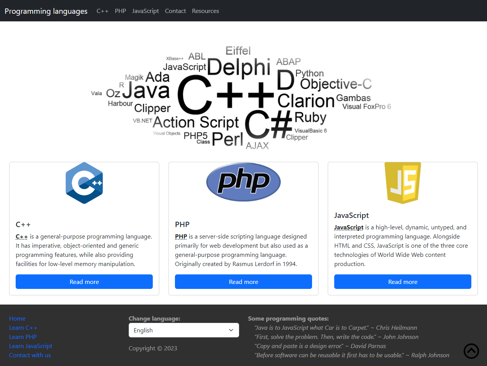
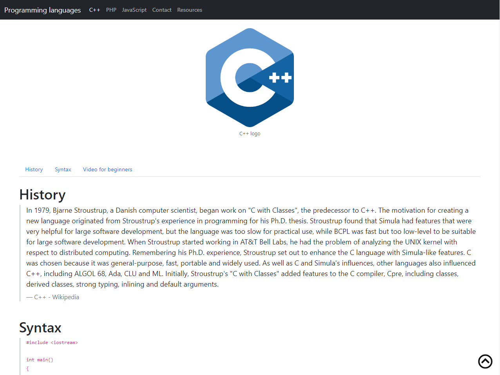
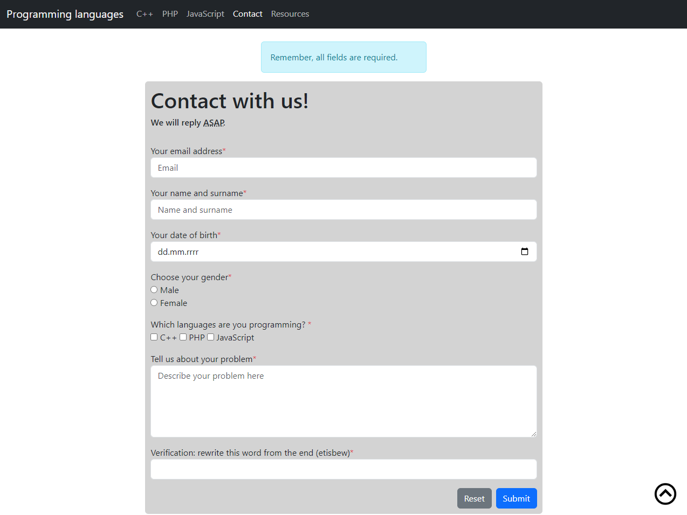
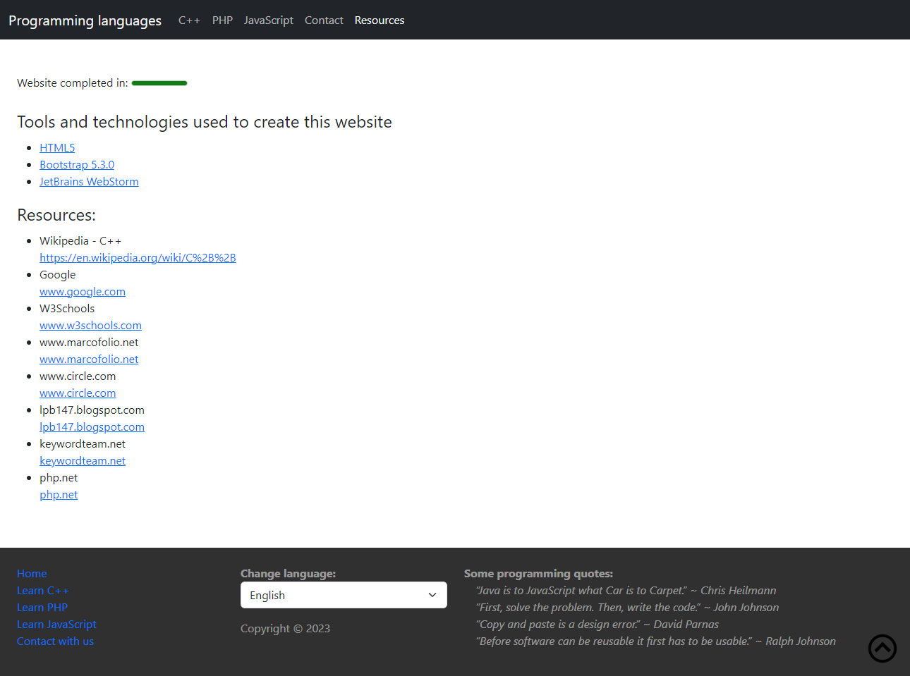
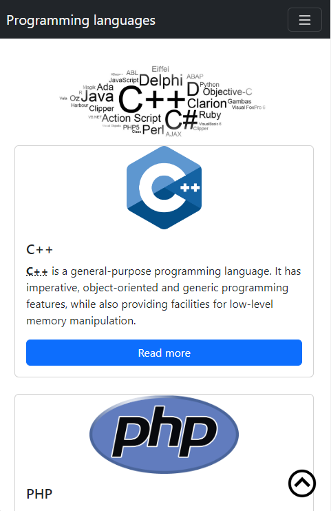
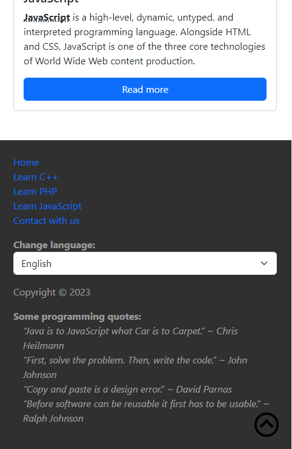

# Simple Bootstrap Website
A very simple page built with HTML5 and Bootstrap 5 only. This page is W3C validated.
Enjoy :muscle:

# Getting started
1. Clone this repo
```
git clone https://github.com/krzysztofhewelt/xxxx
```
2. Open file index.html in your browser.

# Screenshots
<details>
    <summary>Click to show</summary>
    
    
    
    
    
    
</details>

# Technologies
- HTML5
- CSS3
- Bootstrap 5
